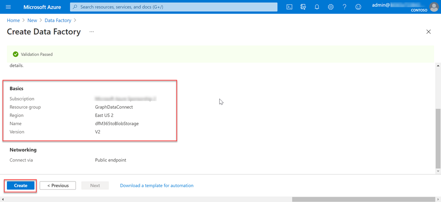
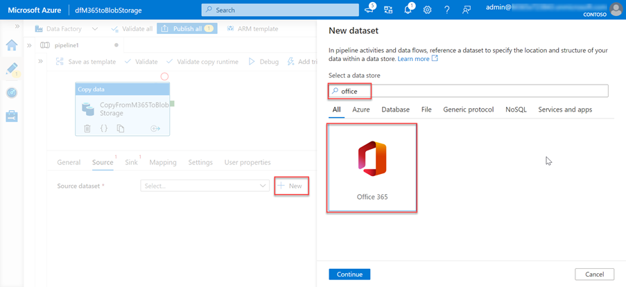

<!-- markdownlint-disable MD002 MD041 -->

A próxima etapa é usar o Azure Data Factory para criar um pipeline para extrair os dados do Microsoft 365 para a conta de Armazenamento do Azure usando a conexão de dados do Microsoft Graph.

## Criar um Azure Data Factory pipeline

1. Abra um navegador e vá para o [Portal do Azure](https://portal.azure.com/).

1. Entre usando uma conta com direitos **Administrador global** seus locatários do Azure e do Microsoft 365.

1. Na barra lateral de navegação, selecione **Criar um recurso**.

1. Localize **o tipo de recurso do Data Factory** e use os valores a seguir para criar e selecione **Criar**.

    1. **Assinatura**: selecione sua assinatura do Azure
    2. **Grupo de recursos**: GraphDataConnect
    3. **Região**: escolha uma região do Azure na mesma região que a região do Microsoft 365
    4. **Nome**: dfM365toBlobStorage
    5. **Versão**: V2

        

    6. Na guia **configuração do Git** , configure o Git ou selecione a opção _Configurar o Git mais tarde_.

1. Depois que o Azure Data Factory for criado, selecione o bloco Autor e  Monitor para iniciar o Azure Data Factory de tela inteira.

    

1. Alterne da Visão **Geral** para **a Experiência** de Gerenciamento selecionando-a na navegação à esquerda.

1. Por padrão, o Azure Data Factory usará um runtime de integração que está resolvendo automaticamente a região. Como o Data Connect requer que sua origem e destino e o runtime de integração existam na mesma região do Microsoft 365, recomendamos que você crie um novo runtime de integração com uma região fixa.

    1. Selecione **Integration Runtimes** > **New**.
    2. Selecione **Azure, Auto-Hospedado e** **Continue**.
    3. Selecione **O Azure para** o ambiente de rede e **selecione Continuar**.

        

    4. Use os detalhes a seguir para concluir o formulário na tela final e, em seguida, selecione **Criar**.

        - **Nome**: nome do runtime de integração
        - **Descrição**: insira uma descrição
        - **Região**: selecione a região que corresponde à sua região do Microsoft 365
        - **Configuração de rede virtual (versão prévia)**: desabilitada

1. Alterne da **experiência Gerenciar** para **o Autor** selecionando-a na navegação à esquerda.
1. Crie um pipeline selecionando o ícone **de adição** e, em seguida, **o pipeline**.

    

    - Arraste a **atividade Copiar Dados** da seção **Mover e Transformar** para a superfície de design.

        

    - Selecione a atividade no designer.
    - Selecione a **guia** Geral e dê a ela um nome e uma descrição.

      - **Nome**: CopyFromM365toBlobStorage
      - **Descrição**: uma descrição desejada.

    - No painel do editor de atividades abaixo do designer, selecione a  guia Origem e, em seguida, **selecione Novo**.
    - Localize o conjunto **Office 365**, selecione-o e, em seguida, selecione o **botão** Continuar.

        

    - O designer atualizará a **guia Origem** com as configurações do conector do Microsoft 365.
    - Selecione a **opção Abrir** ao lado do campo Conjunto **de dados de origem** .
    - Nas configurações da tabela, selecione a **guia** Conexão e, em seguida, o **botão** Novo.
    - Na caixa  de diálogo exibida Azure AD, insira a ID do Aplicativo e a **ID** do Segredo do  aplicativo criadas anteriormente nos campos **ID** da entidade de serviço e chave da entidade de serviço, respectivamente, e selecione **Criar**.
    - Selecione o runtime de integração que você criou anteriormente na lista suspensa Conectar por meio **do runtime** de integração.

        

    - Depois de criar a conexão do Microsoft 365, para o **campo** Tabela, selecione **BasicDataSet_v0. Message_v0.**
    - Alterne **do Office365Table para** o **Pipeline > Origem**. Use os valores a seguir para o **filtro Data**.

      - **Nome da coluna**: CreatedDateTime
      - **Hora de início (UTC):** selecione uma data antes da data atual
      - **Hora de término (UTC):** selecione a data atual
      - Selecione **Importar esquema na** seção _Colunas de_ saída.

    - Selecione a **atividade Copiar dados** na guia pipeline e, em seguida, selecione a **guia** Coletor.

      - Selecione o **botão Novo**, selecione **Armazenamento de Blobs do Azure** e, em seguida, selecione o **botão** Continuar.
      - Selecione **Binário como** o formato dos dados e, em seguida, selecione o **botão** Continuar.
      - Dê ao conjunto de dados o **nome M365JsonFile** e crie um novo serviço vinculado se ele ainda não existir.

    - Na tabela, selecione **a guia Conexão** e selecione **Novo**.
    - Defina os seguintes valores na caixa de diálogo e selecione **Concluir**.

        - **Método de autenticação**: entidade de serviço
        - **Assinatura do Azure**: Selecionar tudo
        - **Nome da conta de** armazenamento: mgdcm365datastore
          - Essa é a conta de armazenamento criada anteriormente neste exercício.
        - **Locatário**: insira a ID do seu locatário do Azure
        - **ID da entidade de** serviço: insira a ID do Azure AD aplicativo criado anteriormente
        - **Chave da entidade de** serviço: insira a chave com hash do Azure AD aplicativo criado anteriormente

    - Ao lado do campo **Caminho do arquivo** , selecione **Procurar**.
    - Selecione o nome do contêiner de armazenamento criado anteriormente.

      

1. Com o pipeline criado, selecione **o botão Validar** Tudo na parte superior do designer.

1. Depois de validar (e corrigir os problemas encontrados), selecione o botão Publicar **Tudo** na parte superior do designer.

## Executar o Azure Data Factory Pipeline

Com o pipeline criado, agora é hora de executar.

> [!NOTE]
> Pode levar vários minutos para que a solicitação de consentimento apareça e não é incomum para todo o processo (iniciar, solicitar consentimento e depois de aprovar o consentimento concluindo a execução do pipeline) para levar mais de 40 minutos.

1. No designer Azure Data Factory, com o pipeline aberto, selecione **Adicionar gatilho > Gatilho Agora**.

    

1. Depois de iniciar o trabalho, no menu da barra lateral, selecione **Monitor** para exibir os trabalhos em execução atuais.

1. Na barra de navegação do lado esquerdo, localize a **guia Execuções de pipeline** e selecione-a. Selecione o pipeline na coluna **Nome do pipeline** para exibir as **execuções de atividade**. Esse pipeline será mostrado _como Em andamento_.

    

1. Depois que você estiver no **modo de** exibição Execuções  de atividade, vá para a seção Execuções de atividade, que está localizada no lado inferior da página.

1. Passe o mouse sobre **o nome da** atividade e selecione a opção de alternâncias. Isso abrirá a **guia Detalhes** .

    

1. Na tela **Detalhes** , procure o status da atividade de pipeline, conforme realçado na imagem a seguir. Nesse caso, você pode ver que ele está em um estado de **RequestingConsent**.

    

1. Neste ponto, a execução da atividade é pausada internamente até que alguém aprove manualmente a solicitação de consentimento por meio do Centro de administração do Microsoft 365 ou por meio do PowerShell.
