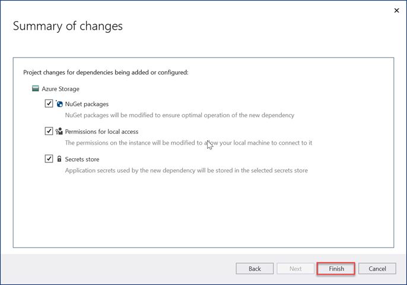
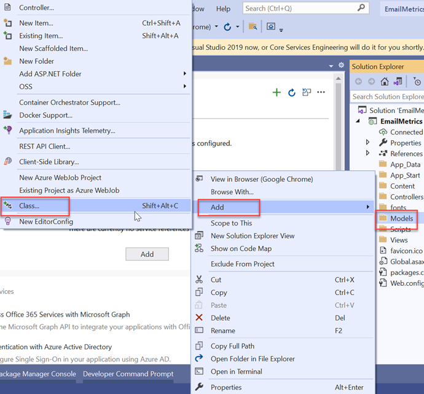
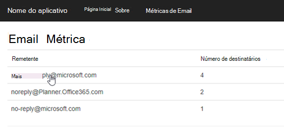

<!-- markdownlint-disable MD002 MD041 -->

Nesta seção, criaremos seu primeiro aplicativo ASP.NET projeto para processar os dados do Microsoft Graph Data Connect que foram exportados.

## <a name="create-a-new-aspnet-project"></a>Criar um novo ASP.NET projeto

1. Abra o Visual Studio e selecione **Arquivo > Novo > Projeto**.

1. Na caixa **de diálogo Novo** Projeto, faça o seguinte.

    1. **Pesquise ASP.NET Aplicativo Web** na caixa de pesquisa e selecione **a opção ASP.NET Aplicativo Web (.NET Framework).**
    1. Clique em **Avançar**.

        

    1. Insira **EmailMetrics** para o nome do projeto.
    1. Selecione **.NET Framework 4.7.2 para** a opção de estrutura.
    1. Selecionar **Criar**.

    > [!IMPORTANT]
    > Insira exatamente o mesmo nome para o Projeto do Visual Studio especificado nas instruções de início rápido. O nome do projeto Visual Studio torna-se parte do namespace no código. O código dentro dessas instruções depende do namespace correspondente ao nome do projeto Visual Studio especificado nessas instruções. Se você usar um nome de projeto diferente, o código não será compilado, a menos que você ajuste todos os namespaces para corresponder ao nome do projeto do Visual Studio inserido ao criar o projeto.

    1. Na nova caixa **ASP.NET do projeto de Aplicativo Web** , selecione MVC.
    1. Selecionar **Criar**.

    

## <a name="add-and-configure-your-azure-storage-as-a-connected-service"></a>Adicionar e configurar o Armazenamento do Azure como um Serviço Conectado

1. Na janela **Gerenciador de Soluções** ferramenta, clique com o botão direito do mouse no nó Serviços **Conectados** e selecione **Adicionar Serviço Conectado**.

    

1. Na caixa **de diálogo Serviços** Conectados, selecione o **+** sinal verde localizado no canto superior direito da caixa de diálogo.

1. Na caixa **de diálogo Adicionar dependência** , selecione Armazenamento **do Azure** e **selecione Avançar**.

    

1. Na caixa **de diálogo Armazenamento do Azure** , selecione a assinatura e a conta de armazenamento em que você exportou os dados no exercício anterior e selecione **Avançar**.

    

1. Forneça à **conexão de Armazenamento do Azure** um nome **de AzureStorageConnectionString** e selecione **Avançar**.
1. Selecione **Concluir**.

    

## <a name="create-a-new-model-class-that-will-be-used-to-store-the-email-metrics"></a>Criar uma nova classe de modelo que será usada para armazenar as métricas de email

1. Na janela **Gerenciador de Soluções** ferramenta, clique com o botão direito do mouse na  pasta Modelos e selecione **Adicionar > Classe**.

    

1. Na caixa **de diálogo Adicionar Novo Item** , selecione **Classe**, defina o nome do arquivo como _EmailMetric.cs_ e **selecione Adicionar**.

1. Adicione o código a seguir à classe EmailMetric que você acabou de criar.

    ```csharp
    public string Email;
    public double RecipientsToEmail;
    ```

## <a name="create-a-new-controller-that-will-calculate-and-display-the-results"></a>Criar um novo controlador que calculará e exibirá os resultados

1. Clique com o botão direito do mouse na **pasta** Controladores e selecione **Adicionar > Controlador**.

1. Na caixa **de diálogo Adicionar Scaffold** , selecione **Controlador MVC 5 – Vazio** e **selecione Adicionar**.

1. Quando solicitado, nomeie o controlador **EmailMetricsController** e selecione **OK**.

1. Adicione as instruções using a seguir após as instruções using existentes na parte superior do arquivo que contém a **classe EmailMetricsController** .

    ```csharp
    using System.Collections.Generic;
    using System.Configuration;
    using System.IO;
    using System.Linq;
    using System.Threading.Tasks;
    using System.Web.Mvc;
    using Azure.Storage.Blobs;
    using Azure.Storage.Blobs.Models;
    using Newtonsoft.Json.Linq;
    ```

1. Adicione o código a seguir à **classe EmailMetricsController** . Eles serão usados para se conectar à Conta **de Armazenamento do Azure** que contém os dados exportados.

    ```csharp
    private const string connectionStringName = "AzureStorageConnectionString";
    private const string emailBlobName = "m365mails";

    ```

1. Adicione o método a seguir à **classe EmailMetricsController** . Isso processará um **Blob do Azure** e atualizará uma coleção que representa as contas de email e quantos destinatários foram combinados em todos os emails encontrados para as contas extraídas.

    ```csharp
    private async Task ProcessBlobEmails(List<Models.EmailMetric> emailMetrics, BlobClient emailBlob)
    {
        using (var stream = new MemoryStream())
        {
            var response = await emailBlob.DownloadToAsync(stream);
            var pos = stream.Seek(0, SeekOrigin.Begin);

            using (var reader = new StreamReader(stream))
            {

                string line;
                while ((line = reader.ReadLine()) != null)
                {
                    var jsonObj = JObject.Parse(line);

                    // extract sender
                    var sender = jsonObj.SelectToken("Sender.EmailAddress.Address")?.ToString();
                    // No sender - skip this one
                    if (string.IsNullOrEmpty(sender)) continue;

                    // extract and count up recipients
                    var totalRecipients = 0;
                    totalRecipients += jsonObj.SelectToken("ToRecipients")?.Children().Count() ?? 0;
                    totalRecipients += jsonObj.SelectToken("CcRecipients")?.Children().Count() ?? 0;
                    totalRecipients += jsonObj.SelectToken("BccRecipients")?.Children().Count() ?? 0;

                    var emailMetric = new Models.EmailMetric();
                    emailMetric.Email = sender;
                    emailMetric.RecipientsToEmail = totalRecipients;

                    // if already have this sender...
                    var existingMetric = emailMetrics.FirstOrDefault(metric => metric.Email == emailMetric.Email);
                    if (existingMetric != null)
                    {
                        existingMetric.RecipientsToEmail += emailMetric.RecipientsToEmail;
                    }
                    else
                    {
                        emailMetrics.Add(emailMetric);
                    }
                }
            }
        }
    }
    ```

1. Adicione o método a seguir à **classe EmailMetricsController** . Isso enumerará todos os blobs no contêiner especificado da conta de Armazenamento do **Azure** `ProcessBlobEmails()` especificado e enviará cada um para o método adicionado na última etapa.

    ```csharp
    private async Task<List<Models.EmailMetric>> ProcessBlobFiles()
    {
        var emailMetrics = new List<Models.EmailMetric>();
        var connectionString = ConfigurationManager.ConnectionStrings[connectionStringName];

        // Connect to the storage account
        var containerClient = new BlobContainerClient(connectionString.ConnectionString, emailBlobName);

        foreach (var blob in containerClient.GetBlobs())
        {
            if (blob.Properties.BlobType == BlobType.Block &&
                // Don't process blobs in the metadata folder
                !blob.Name.StartsWith("metadata/"))
            {
                var blobClient = containerClient.GetBlobClient(blob.Name);
                await ProcessBlobEmails(emailMetrics, blobClient);
            }
        }

        return emailMetrics;
    }
    ```

1. Adicione a ação a seguir ao **EmailMetricsController** que usará os métodos adicionados a essa classe para processar os emails e enviar os resultados para a exibição.

    ```csharp
    [HttpPost, ActionName("ShowMetrics")]
    [ValidateAntiForgeryToken]
    public async Task<ActionResult> ShowMetrics()
    {
        var emailMetrics = await ProcessBlobFiles();

        return View(emailMetrics);
    }
    ```

## <a name="create-a-new-view-for-the-emailmetrics-index-action"></a>Criar uma nova exibição para a ação de índice EmailMetrics

1. Na janela **Gerenciador de Soluções** ferramenta, clique com o botão direito do mouse na pasta **Exibições > EmailMetrics** e selecione **Adicionar > Exibição**.

1. Na caixa **de diálogo Adicionar Novo Item Scaffolded** , selecione Exibição **do MVC 5** e, em seguida, **selecione Adicionar**.

1. Na caixa **de diálogo Adicionar Exibição** , defina o nome **da** exibição como **Índice**, deixe os controles de entrada restantes com seus valores padrão e selecione **Adicionar**.

    

1. Atualize a marcação nas novas Exibições **> EmailMetrics > _Index.cshtml_** para o seguinte. Isso adicionará um formulário com um único botão que enviará um HTTP POST para a ação do controlador personalizado adicionada na última etapa.

    ```html
    @{
    ViewBag.Title = "Index";
    }

    <h2>Email Metrics</h2>
    ```

1. Esse aplicativo examinará os dados de email de emails extraídos para a conta **Armazenamento de Blobs do Azure** e exibirá o número total de destinatários de cada remetente.

    ```html
    @using (Html.BeginForm("ShowMetrics", "EmailMetrics", FormMethod.Post))
    {
    @Html.AntiForgeryToken()
    <div>
        <button type="submit">View email metrics</button>
    </div>

    <div>
        <em>Please be patient as this can take a few moments to calculate depending on the size of the exported data...</em>
    </div>
    }
    ```

## <a name="create-a-new-view-for-the-emailmetrics-showmetrics-action"></a>Criar um novo modo de exibição para a ação EmailMetrics ShowMetrics

1. Na janela **Gerenciador de Soluções** ferramenta, clique com o botão direito do mouse na pasta **Exibições > EmailMetrics** e selecione **Adicionar > Exibição**.

1. Na caixa **de diálogo Adicionar Exibição** , defina os valores a seguir e deixe os controles de entrada restantes com seus valores padrão e selecione **Adicionar**.

    - **Nome da exibição**: ShowMetrics
    - **Modelo**: Lista
    - **Classe de modelo**: EmailMetric (EmailMetric.Models)

        

    >[!TIP]
    > Caso você não possa ver o modelo **EmailMetric** na caixa suspensa, crie a solução.

1. Atualize a marcação nas novas Exibições **> EmailMetrics > _ShowMetrics.cshtml_** para o seguinte. Isso exibirá os resultados dos cálculos.

    ```html
    @model IEnumerable<EmailMetrics.Models.EmailMetric>

    @{
    ViewBag.Title = "ShowMetrics";
    }

    <h2>Email Metrics</h2>

    <table class="table">
    <tr>
        <th>Sender</th>
        <th>Number of Recipients</th>
    </tr>

    @foreach (var item in Model)
    {
    <tr>
        <td>@Html.DisplayFor(modelItem => item.Email)</td>
        <td>@Html.DisplayFor(modelItem => item.RecipientsToEmail)</td>
    </tr>
    }

    </table>
    ```

## <a name="update-the-navigation-to-have-a-way-to-get-to-the-new-controller"></a>Atualizar a navegação para ter uma maneira de acessar o novo controlador

1. Na janela **Gerenciador de Soluções** ferramenta, localize e abra o arquivo **Views > Shared > _Layout.cshtml_**.
1. Substitua o conteúdo pelo código a seguir.

    ```html
    <!-- new code -->
    <li>@Html.ActionLink("Email Metrics", "Index", "EmailMetrics")</li>
    ```

## <a name="test-the-application"></a>Teste o aplicativo

1. No Visual Studio, selecione **Depurar > Iniciar Depuração**.

1. Quando o aplicativo for criado e carregado em uma nova janela do navegador, selecione o item **Métricas de Email** na barra de navegação superior.

1. Na página **Métricas de Email** , selecione o botão **Exibir métricas de email** .

    

1. Quando a página for carregada, você verá uma lista de endereços de email que foram encontrados entre todos os emails com uma soma de todos os destinatários enviados entre eles, conforme mostrado em um pequeno conjunto de exemplos em uma extração de email de teste na figura a seguir.

    
